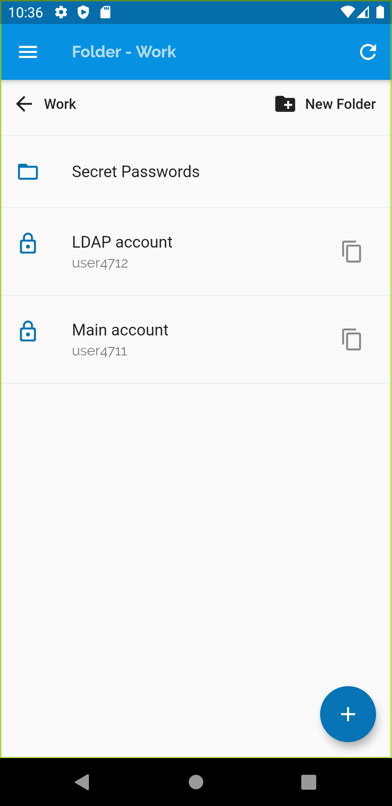
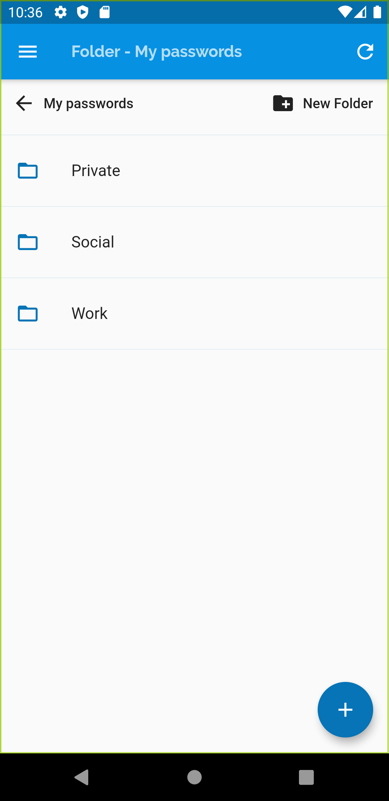
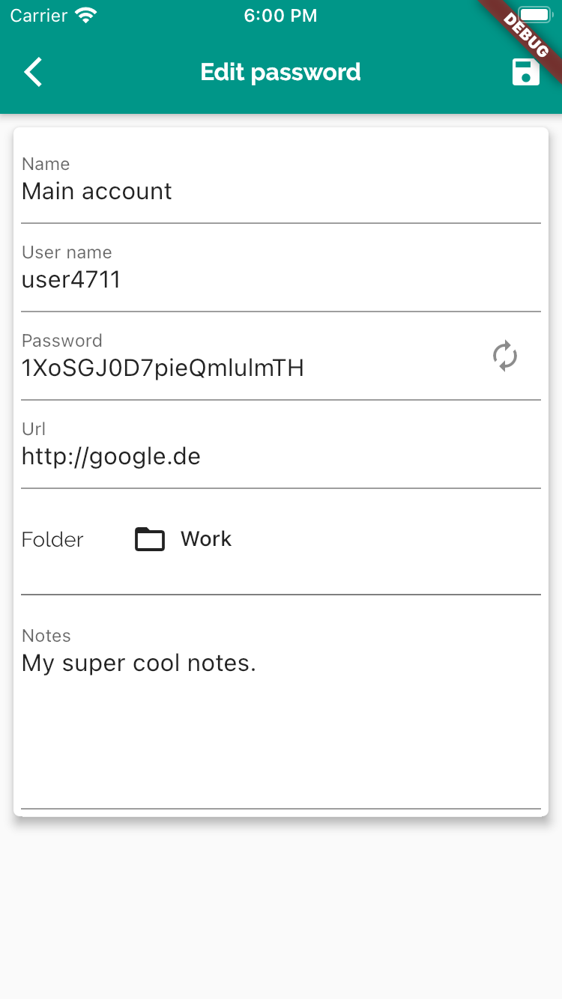
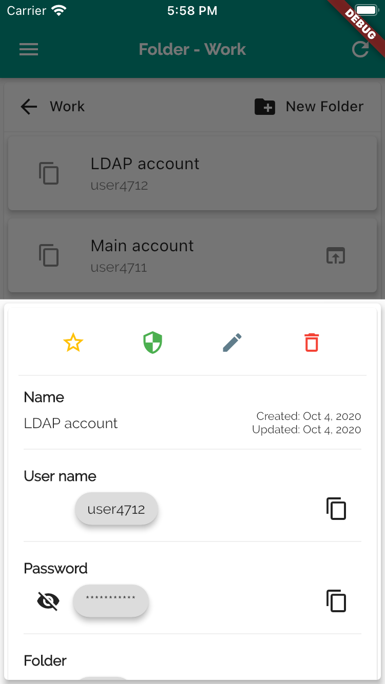
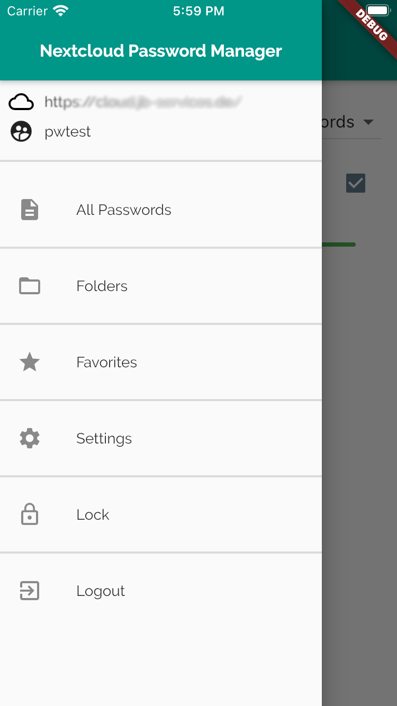
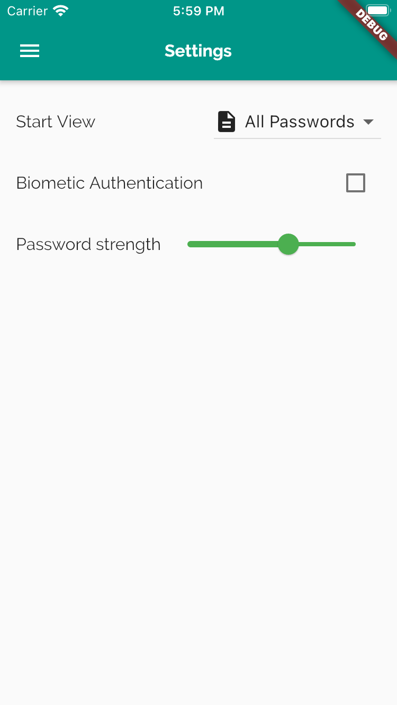

# Password Manager App
powered by [Nextcloud](https://nextcloud.com/).


A password manager app (android + iOS) for Nextcloud's [Passwords](https://apps.nextcloud.com/apps/passwords) app.

You can [Install the Android App](https://play.google.com/store/apps/details?id=de.jbservices.nc_passwords_app) on your Android device via the Google Play store.

[](https://play.google.com/store/apps/details?id=de.jbservices.nc_passwords_app)

By now, the iOS app must be build by yourself.

## Getting Started

This application is build with [Flutter](https://flutter.dev/) and uses the [API](https://git.mdns.eu/nextcloud/passwords/wikis/developers/index) provided by the Passwords App.

[Install and configure flutter](https://flutter.dev/docs/get-started/install), then clone this repository. Then run
```flutter run```
for a debug preview on a started emulator, a connected Android or iOs device.

## Features
- View your passwords (with a clipboard functionality)
- Create/Update/Delete your passwords
- Autofill Support on Android
- View/Set/Unset your favorites
- Fast search of your passwords
- View your passwords in the folder structure
- Optional Local Biometric Authentication
- Local cache of your passwords (if you have no current internet connection)








## Future features
- Tag support
- Client side encryption
- more? create an [Issues](https://gitlab.com/joleaf/nc-passwords-app/-/issues/new) :)
