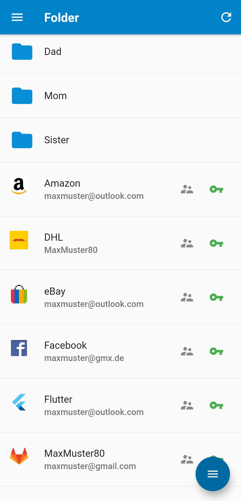
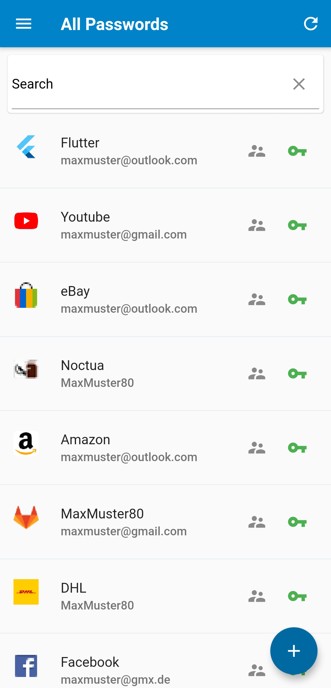

# Password Manager App
Powered by [Nextcloud](https://nextcloud.com/).


A password manager app (Android + iOS) for Nextcloud's [Passwords](https://apps.nextcloud.com/apps/passwords) app.

## Install 

### Android
You can install the Android App on your Android device via the [Google Play store](https://play.google.com/store/apps/details?id=de.jbservices.nc_passwords_app) or via [fdroid](https://f-droid.org/de/packages/de.jbservices.nc_passwords_app/).

[](https://play.google.com/store/apps/details?id=de.jbservices.nc_passwords_app)
[](https://f-droid.org/de/packages/de.jbservices.nc_passwords_app/)

Or install the apk from the last pipeline job:

[](https://gitlab.com/joleaf/nc-passwords-app/-/commits/main)

### iOS
As of now, the iOS app must be built by yourself. 
Or, take a look at [this](https://github.com/johannes-schliephake/nextcloud-passwords-ios) native iOS project.

## Donate
<a href="https://www.buymeacoffee.com/joleaf" target="_blank"></a>

## Getting Started

This application is built with [Flutter](https://flutter.dev/) and uses the [API](https://git.mdns.eu/nextcloud/passwords/wikis/developers/index) provided by the Passwords App.

[Install and configure flutter](https://flutter.dev/docs/get-started/install), then clone this repository. Then run ```flutter run``` for a debug preview on a started emulator, a connected Android or iOS device.

Depending on the changes you made you may also need to run these commands before running the application:

```flutter clean```

```flutter pub get```

```flutter pub run flutter_launcher_icons:main```

## Contributors
- [@domi77fullhd](https://gitlab.com/domi77fullhd) - Thank you for your UI support.
- [@sepo83](https://gitlab.com/sepo83) - Thank you for the support of the fdroid integration.

## Features
- View your passwords (with quick copy to clipboard functionality)
- Create/Update/Delete your passwords
- Autofill Support on Android
- View/Set/Unset your favorites
- Fast search of your passwords
- View your passwords in folder view
- Optional local biometric authentication
- Local cache of your passwords (if you have no current internet connection)
- Nextcloud theming
- Displaying the icons of linked websites
- Client side encryption








## Future features
- Tag support
- Missing something? Create an [Issue](https://gitlab.com/joleaf/nc-passwords-app/-/issues/new) :)
